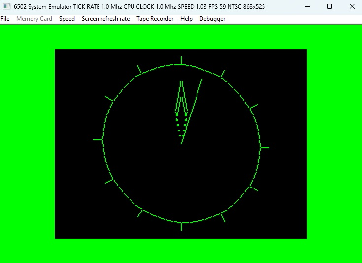
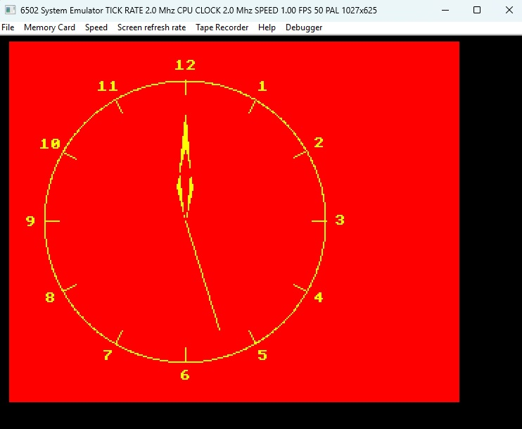
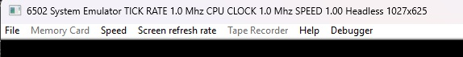

# AtomEmulUtils
AtomEmulUtils is an emulation framework that makes it possible to "build" a 6502-based computer system from a set of predefined hardware devices.
Devices are selected and "connected" using a configuration file (referred to as a map file as it includes a memory map for the emulated system).
The following hardware devices are currently supported:
- ADC 7002 12-bit Analogue-to-Digital Converter (used in e.g., the BBC Micro)
- DAC ZN428 8-bit Digital-to-Analogue Converter
- M6850 ACIA
- Acorn Atom Cassette Interface
- Acorn Atom Keyboard (the keyboard matrix)
- Acorn Atom Sound Device (basically just a speaker)
- BBC Micro Keyboard (the keyboard matrix)
- BBC Micro Paged Memory Selection Interface
- BBC Micro Serial ULA 
- BBC Micro Video ULA
- H6845 CRT Controller
- 74LS259 8-bit Addressable Latch
- 8255 PIA
- NMOS 6502 Instruction-stepped
- NMOS 6502 Micro cycle-stepped
- DRAM
- Static RAM
- ROM (a ROM data file associated with it can hold e.g., an operating system)
- SN76489 Tone Generator (used in e.g., the BBC Micro)
- SAA5050 Teletext Character Generator
- MC6847 Video Display Generator
- 6522 VIA

There are also a few devices that are not part of the computer system that emulates external equipment connected to the computer system:
- SD Card with SPI interface (SD Card File System ROM software like https://github.com/hoglet67/MMFS for the BBC Micro can use this)
- Tape Recorder (allows for tape audio files to be streamed to and from the computer system)

See [Installation instructions](docs/Installation.md) for details on how to install the emulator.

See [Implementation of the emulator](docs/Implementation.md) for details on how the emulator works and is implemented.

The emulator is run from command line and cannot run without a map file that defines your computer system:
```
> Emu6502 -map <path to map file>
```
You will find several example systems in the folder 'Examples'.
E.g., 'AtomEmulUtils/Examples/Atom/ROMs/AtomMemoryMap.txt' defines a basic Acorn Atom computer system.
To start the emulation of that system you simply give the command:
```
> Emu6502 -map AtomEmulUtils/Examples/Atom/ROMs/AtomMemoryMap.txt
```
The Atom emulation looks like this:


Other systems include a BBC Micro system and some simple headless systems (systems just with a microprocessor and memory).
To start the emulation of that system you simply give the command:
```
> Emu6502 -map AtomEmulUtils/Examples/Beeb/ROMs/BeebMemoryMap.txt
```
The Beeb emulation looks like this:


The map file and ROM files (with operating systems or your own software) need to be located in the same folder as the
map file.

The utility doesn't include any assembler but the example assembler files are written in a way that is compatible with e.g.,
the beebasm assmebler (https://github.com/stardot/beebasm). What is included is however a simple disassembler ('Dis') that
you can run on any binary file content (like a ROM file).

## A simple example system
To get a taste of how a map file could look like for an emulated computer system we will start with the
simplest of all systems. A system with just memory and a microprocessor:

```
ADD	CPU_6502	CPU		1												// CPU
ADD	SRAM		STACK	0100	0200	1								// Stack space
ADD	SRAM		DATA	4000	0100	1								// Program data (256 bytes)
ADD	ROM			PGM		f000	1000	1			ADC_test.rom		// Program (starts at f000;RESET vector points there)
```

The first line tells that there shall be a 6502 microprocessor. The three other lines defines two static RAMs and a ROM.
The first parameter is the device type and the second one is the name of a unique instance of the device
(here you could use names like 'IC11', 'IC12' etc. if you like as each instance kind of represents 
a component on a PCB).
The last parameter (which is '1') specifies the access speed[^1] of the memories as well as the CPU clock rate.
The third and  forth parameters for the memory devices specify where in the memory map each device resides. E.g.,
the SRAM 'STACK' resides in memory 0x100 to 0x2ff (start address 0x100 and size 0x200).

[^1]: The access speed parameter will not be used by the emulator in this simple example (but still needs to be specified). It matters only when clock stretching is enabled.

Details about the content of a map file cand be found in [Map File Content](docs/Configuration.md).

## Interacting with the emulated computer system
The emulator comes with a menu bar that allows the user to control the emulation and provide input data (e.g. tape audio or text input):



See [Menus](docs/Menu.md) for details about all the menu options.