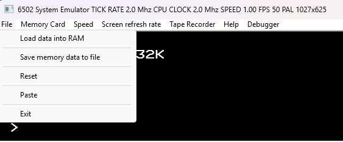
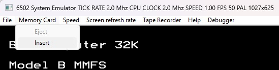
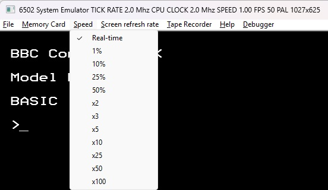
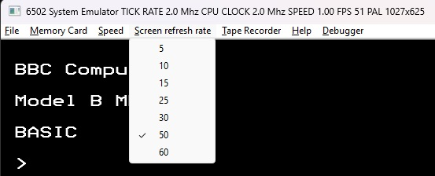
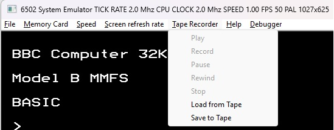
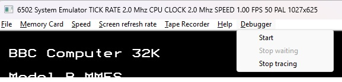

# The Menu Bar

## The File Menu
The File Menu allows you to load data from a file directly into memory.
For this to work, the data file needs to be accompanied by an .INF file
with information about the load address. E.g., if you want to load data
from a file 'GEST.bin' to memory locations 0xe00 and forwards, then a file
GEST.inf with the content
```
GTEST	0e00
```
needs to be created. The base part of the data file and the .INF files needs
to match.

To save memory data to file, the file name needs to include both the start
and end address of the data area to save. To save e.g, the memory content
0xe00 to 0xeff, the file name shall be similar to 'data_e00_eff.bin'. The file
extension or naming of the file doesn't matter.



## The Memory Card Menu
If the system has the SDCard device, then you will be able to 'insert'
an SD Card by selecting a data file. The format of the data file needs
to match that required by the software of your emulated computer system.
If you e.g. use the MMFS software for the BBC Micro (see https://github.com/hoglet67/MMFS/wiki),
then the format can be MMB (see https://github.com/hoglet67/MMFS/wiki/MMB-File-Format).



## The Speed Menu
It is possible to slow down or speed up the emulation.
The emulation speed is default 'real time' but can be changed to be slower or faster. How fast it can become depends on the host computer and the complexity of
the emulated computer system. Don't expect much higher speed than real time for a complex system. 
You can always slow down but how much you can
speed up (if at all) depends on the capabilities of the host computer you run the emulator on.
The slowest you can run is at 1% of real time and the fastest you can run is 100 times real time
(for very simple systems you might come up to 25 times real time but for more complex ones it will
probbaly be more like a few times real time only).



## The Screen Refresh Rate Menu
When a video display device is present, the update rate 
(perceived frame rate) of the display can be adjusted (slowed down) to improvde emulation performance. The default is to use that of the selected TV standard
(50 Hz for PAL and 60 Hz for NTSC).



## The Tape Recorder Menu
If you emulated computer system has a tape recorder device, then you will be able to load
and save tape audio. The format supported is CSW (see https://acorn.huininga.nl/pub/unsorted/software/pc/CSW/csw.html).
The menu mimics the buttons of a real  tape recorder with PLAY, RECORD, REWIND, STOP and PAUSE.
To load from tape,select the _Load from Tape_; then select _Play_.
To save to tape, select _Save to Tape_.; then select _Record_.



## The Debugger Menu
The debugger can be started (_Start_) via this menu. If started, a prompt '>' will appear in the terminal
from which you started the emulator. The menu option _Stop waiting_ is use to get the debugger to
stop waiting for a breakpoint and the option
_Stop tracing_ is used to stop the debugger's trace output.
See [Debugger](docs/Debugger.md) for more details on how to use the debugger. 


